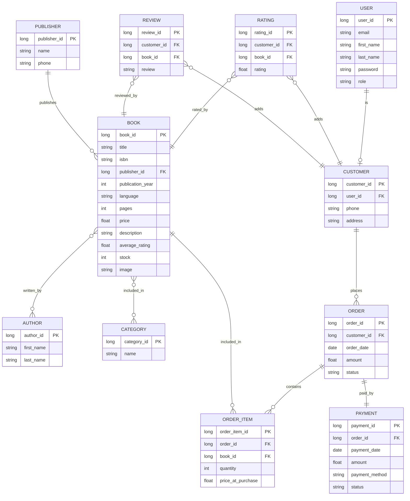

# BookTown
A RESTful web application built with Spring Boot that allows users to browse, manage and purchase books

## Features
* Browse and search books
* Add books to cart and place orders
* User registration and authentication
* Admin panel for managing books, categories and users
* Filter books by different options
* Rate and review books

## Entity Relationship Diagram

